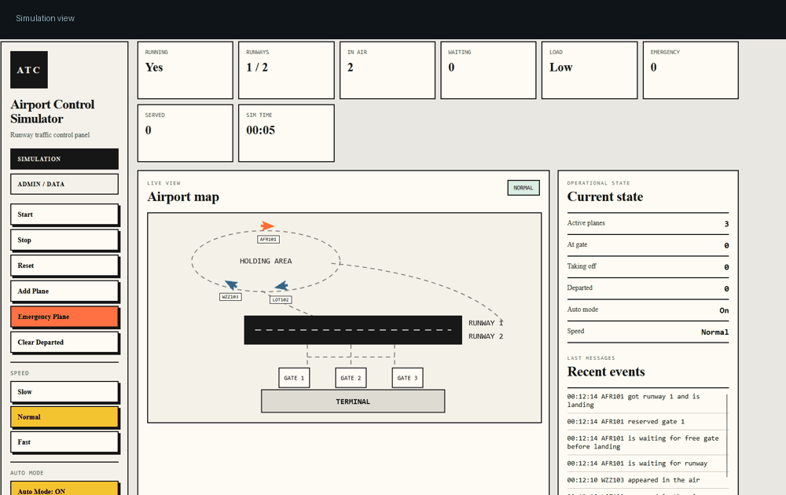

# ✈️ Airport Control Simulator


**Airport Control Simulator** to webowa symulacja pracy lotniska w ASP.NET Core.  
Samoloty krążą w holding area, czekają na wolny gate, lądują, kołują do bramek i startują z pasa w czasie rzeczywistym.

<p align="center">
  
</p>

---

## 🚀 Najważniejsze funkcje

- ✈️ animowana mapa lotniska,
- 🛬 lądowanie i start według tras na SVG,
- 🧵 osobne zadania dla samolotów,
- 🚦 ograniczona liczba pasów startowych,
- 🧱 blokowanie zajętych gate’ów,
- 🚨 emergency plane z priorytetem,
- 🌙 dark mode,
- ⚡ live update przez SignalR,
- 🧾 panel Admin / Data z logami, runwayami i gate’ami,
- 🕒 licznik czasu symulacji,
- 🧹 czyszczenie zakończonych lotów.

---

## 🖼️ Podgląd aplikacji

### 🎮 Simulation


### 🧭 Admin / Data


---

## 🧠 Co pokazuje projekt?

| Mechanizm | Rola w projekcie |
|---|---|
| `lock` | chroni wspólny stan symulacji |
| `SemaphoreSlim` | ogranicza dostęp do runwayów i gate’ów |
| `Task.Run` | uruchamia obsługę samolotów w tle |
| `async/await` | pozwala symulować opóźnienia bez blokowania aplikacji |
| SignalR | wysyła live update do frontendu |
| fetch / AJAX | obsługuje przyciski bez przeładowania strony |

---

## 🛠️ Technologie

```text
ASP.NET Core MVC
C#
SignalR
JavaScript
HTML / CSS
SVG
```

---

## ▶️ Uruchomienie

```powershell
dotnet restore
dotnet run
```

Po uruchomieniu otwórz adres pokazany w terminalu, np.:

```text
https://localhost:7246
```

---

## 🧩 Jak działa symulacja?

1. Samolot pojawia się w powietrzu.
2. Krąży w holding area.
3. Czeka, aż będzie wolny gate.
4. Rezerwuje gate.
5. Czeka na wolny runway.
6. Ląduje i kołuje do gate.
7. Przygotowuje się do odlotu.
8. Startuje i znika z mapy.

Dzięki temu korek tworzy się głównie w powietrzu, a nie na pasie startowym.

---

## 🎛️ Panel sterowania

| Przycisk | Działanie |
|---|---|
| Start | uruchamia symulację |
| Stop | zatrzymuje symulację |
| Reset | resetuje stan lotniska |
| Add Plane | dodaje zwykły samolot |
| Emergency Plane | dodaje samolot awaryjny |
| Clear Departed | czyści zakończone loty |
| Dark mode | przełącza motyw |
| Slow / Normal / Fast | ustawia szybkość przed startem |

---

## 📁 Struktura

```text
Samoloty
├── Controllers
├── Hubs
├── Models
├── Services
├── Views
├── wwwroot
│   ├── css
│   └── js
└── screenshots
```

---

## ✅ Status

Projekt jest gotowy do prezentacji i zawiera wymagane mechanizmy współbieżności oraz komunikacji live.
