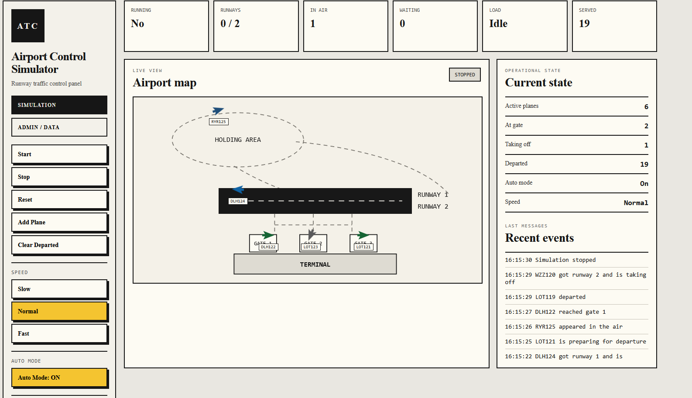
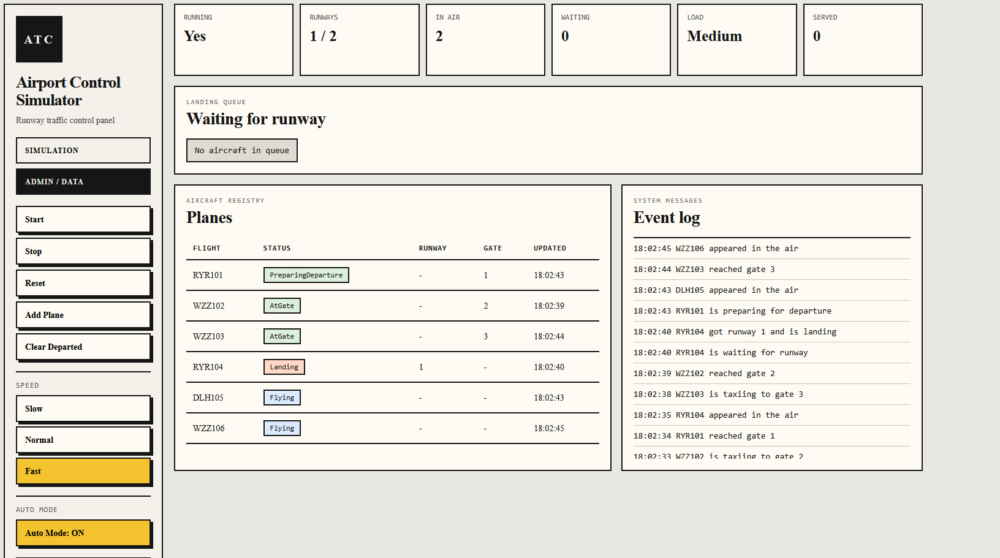
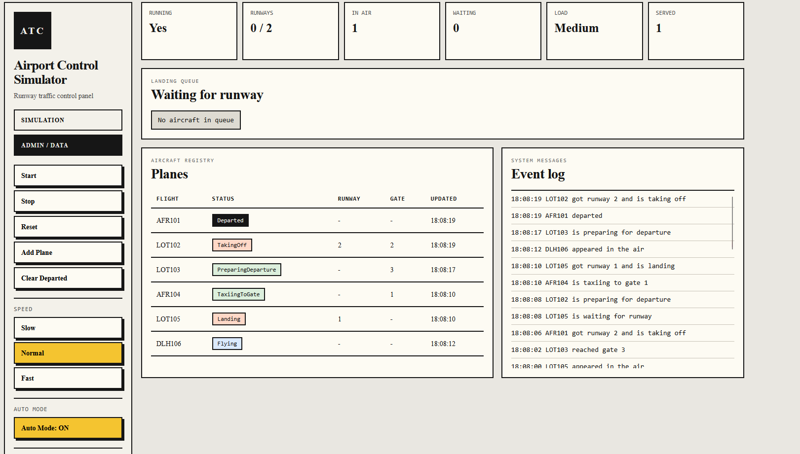

# Airport Control Simulator

Aplikacja webowa w ASP.NET Core symulująca pracę kontroli lotniska. Samoloty pojawiają się w powietrzu, krążą w holding area, oczekują na pas startowy, lądują, kołują do bramek, przygotowują się do odlotu i startują z pasa.

Projekt został przygotowany jako aplikacja zaliczeniowa pokazująca mechanizmy współbieżności, synchronizacji oraz komunikacji w czasie rzeczywistym.

## Funkcje

- symulacja ruchu samolotów w czasie rzeczywistym,
- animowana mapa lotniska SVG,
- dwie zakładki: Simulation oraz Admin / Data,
- start, stop i reset symulacji,
- ręczne dodawanie samolotów,
- tryb automatycznego generowania samolotów,
- dodawanie samolotu awaryjnego,
- kolejka samolotów oczekujących na pas,
- statystyki lotniska,
- log zdarzeń,
- tryb jasny i ciemny,
- czyszczenie zakończonych lotów z tabeli,
- sterowanie szybkością symulacji przed uruchomieniem.

## Zastosowane mechanizmy

| Mechanizm | Zastosowanie |
|---|---|
| `lock` | zabezpiecza listę samolotów, logi, stan symulacji i statystyki |
| `SemaphoreSlim` | ogranicza liczbę dostępnych pasów startowych |
| `Task.Run` | uruchamia obsługę samolotów i generator samolotów w tle |
| `async/await` | obsługuje opóźnienia etapów symulacji bez blokowania aplikacji |
| SignalR / WebSocket | wysyła aktualny stan lotniska do przeglądarki w czasie rzeczywistym |
| AJAX / fetch | obsługuje przyciski sterujące bez przeładowania strony |

## Widok aplikacji

### Simulation



### Admin / Data





## Technologie

- ASP.NET Core MVC
- C#
- SignalR
- HTML
- CSS
- JavaScript
- SVG

## Uruchomienie projektu

Wymagane jest zainstalowane .NET SDK.

```powershell
dotnet restore
dotnet run
```

Po uruchomieniu aplikacja będzie dostępna pod adresem pokazanym w terminalu, na przykład:

```text
https://localhost:7246
```

## Struktura projektu

```text
Samoloty
├── Controllers
│   └── AirportController.cs
├── Hubs
│   └── AirportHub.cs
├── Models
│   ├── Airplane.cs
│   ├── AirportState.cs
│   └── AirportStats.cs
├── Services
│   └── AirportService.cs
├── Views
│   └── Airport
│       └── Index.cshtml
└── wwwroot
    ├── css
    │   └── site.css
    └── js
        └── airport.js
```

## Opis działania

Po uruchomieniu symulacji aplikacja tworzy samoloty i obsługuje każdy z nich w osobnym zadaniu. Samolot przechodzi przez kolejne etapy: lot w powietrzu, oczekiwanie na pas, lądowanie, kołowanie do bramki, postój przy bramce, przygotowanie do odlotu i start.

Dostęp do pasów startowych jest ograniczony przez `SemaphoreSlim`. Dzięki temu jednocześnie z pasa może korzystać tylko określona liczba samolotów. Wspólne dane są zabezpieczone przez `lock`, aby kilka zadań nie zmieniało ich jednocześnie.

Frontend otrzymuje aktualny stan przez SignalR i aktualizuje mapę, tabelę, logi oraz statystyki bez ręcznego odświeżania strony.

## Uwagi

Zmiana szybkości symulacji jest wykonywana przed startem symulacji. Jeżeli symulacja już działa, aplikacja zapisuje w logach informację, że przed zmianą szybkości trzeba ją zatrzymać. Dzięki temu aktywne zadania samolotów nie są przerywane w połowie trasy.
